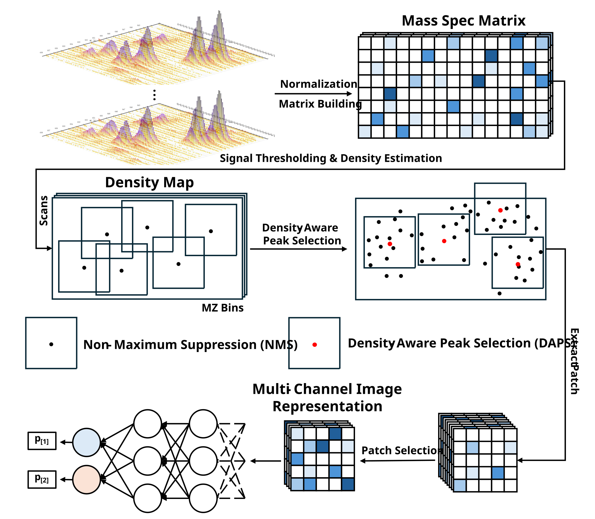

# MSIMG: A Density-Aware Multi-Channel Image Representation Method for Mass Spectrometry

This repository contains the official source code and implementation for the paper **"MSIMG: A Density-Aware Multi-Channel Image Representation Method for Mass Spectrometry"**.

Our work introduces MSIMG, a novel data representation framework that transforms complex, high-dimensional mass spectrometry (MS) data into a multi-channel image format, optimized for deep learning models. Inspired by computer vision techniques, MSIMG employs a data-driven, "density-peak-centric" patch selection strategy (DAPS) to capture the most information-rich regions from raw MS data, leading to significantly improved performance in phenotype classification tasks.



## Key Features

- **Density-Aware Peak Selection (DAPS)**: A novel algorithm that combines density map estimation and non-maximum suppression to dynamically identify and extract signal-dense regions from MS data.
- **High-Fidelity Image Representation**: Converts raw LC-MS data into information-dense, multi-channel images that preserve the integrity of key signal patterns.

## Setup and Installation

### Prerequisites
- CUDA-enabled GPU (for deep learning models)

### 1. Clone the Repository
```bash
git clone [https://github.com/NIM-NMDC/MSIMG.git](https://github.com/NIM-NMDC/MSIMG.git)
cd MSIMG
````

### 2\. Install Dependencies

This project requires the following specific versions of key libraries. You can install them and other necessary packages using pip:

```bash
pip install numpy==2.0.2 pandas==2.3.1 torch==2.7.1+cu126 scikit-learn pyyaml matplotlib
```

**Software Information:**

  - **Python**: `3.9.23`
  - **NumPy**: `2.0.2`
  - **Pandas**: `2.3.1`
  - **PyTorch**: `2.7.1+cu126`

## Data Preparation

The model expects raw mass spectrometry data in the `.mzML` format. Before running any experiments, you must organize your data files under the `datasets/` directory. Each class should have its own subfolder containing the corresponding `.mzML` files.

Please create the directory structure as follows:

```
MSIMG/
├── datasets/
│   └── <YOUR_DATASET_NAME>/
│       ├── <CLASS_A>/
│       │   ├── sample_A_01.mzML
│       │   ├── sample_A_02.mzML
│       │   └── ...
│       └── <CLASS_B>/
│           ├── sample_B_01.mzML
│           ├── sample_B_02.mzML
│           └── ...
└── ...
```

The public datasets used in our paper (SPNS and CD) can be downloaded from the Metabolomics Workbench database under accession IDs `ST001937` and `ST003313`, respectively.

## Running Experiments

Configuration files for datasets (`dataset_config.yaml`) and patch generation (`patch_config.yaml`) are located in the `configs/` directory. Please adjust them according to your dataset and experimental setup.

### Running the MSIMG Method

To run an experiment with the MSIMG (DAPS) method, use the `exp_mass_spectrometry_image.py` script.

```bash
python exp_mass_spectrometry_image.py \
    --dataset_name SPNS \
    --model_name ResNet50 \
    --patch_strategy DAPS \
    --score_strategy Entropy \
    --num_patches 64 \
    --k_folds 5 \
    --batch_size 8 \
    --epochs 64 \
    --device cuda \
    --early_stopping \
    --patience 10
```

### Running the Baseline Methods

To run the traditional peak-list-based baseline experiments, you first need to generate the peak list feature tables from your .mzML files using the mzmine_process_batch.py script.

**Generating Peak Lists:**

  - **For alignment peak lists**, use the `--align` flag:
    ```bash
    python mzmine_batch_process.py \
        --input_dir "input_dir" \
        --output_dir "output_dir" \
        --align
    ```
  - **For non-alignment peak lists**, run the command without the `--align` flag:
    ```bash
    python mzmine_batch_process.py \
        --input_dir "input_dir" \
        --output_dir "output_dir" 
    ```

After generating the feature tables, you can use the `exp_baseline.py` script for training and evaluation. This script supports both classic machine learning models and 1D deep learning models.

**Example for a 1D Deep Learning Model (ResNet50):**

```bash
python exp_baseline.py \
    --dataset_name SPNS \
    --model_name ResNet50 \
    --k_folds 5 \
    --batch_size 8 \
    --epochs 64 \
    --device cuda \
    --early_stopping \
    --patience 10
```

**Example for a Classic Machine Learning Model (Random Forest):**

```bash
python exp_baseline.py \
    --dataset_name SPNS \
    --model_name RF \
    --k_folds 5
```

## License

This project is licensed under the MIT License. See the `LICENSE` file for details.